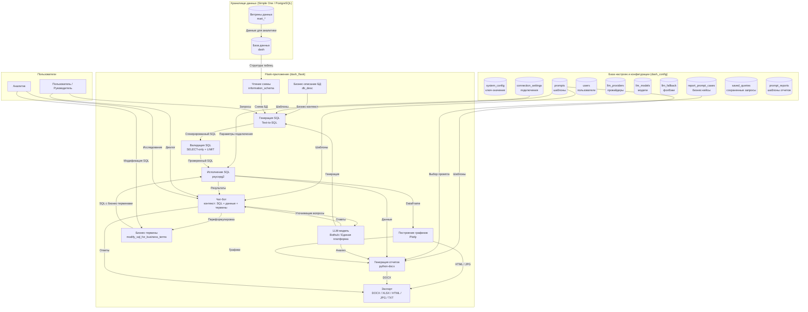
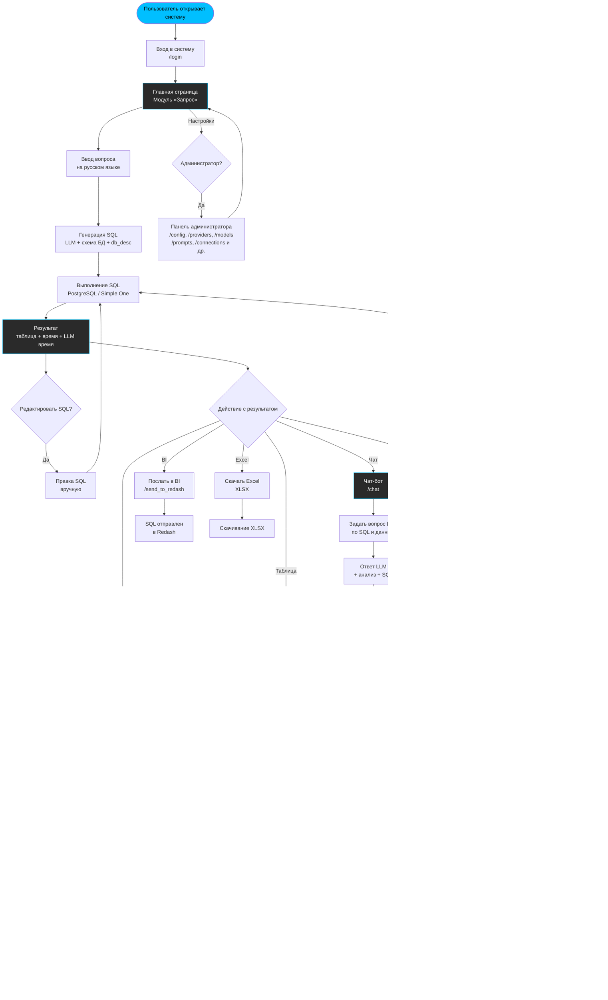

# Архитектура системы Text2BI

## 1. Полный цикл данных (mermaid)

## 2. Описание компонентов и потоков

### 2.1. Источник данных
- **Хранилище** (PostgreSQL / Simple One) содержит пользовательские данные и **витрины данных** (`mart_*`).
- Система автоматически читает структуру через `information_schema.columns`.
- Бизнес-описание (связи таблиц, бизнес-термины) хранится в `system_config.db_desc`.

### 2.2. Генерация и выполнение SQL
1. Пользователь задает вопрос на русском языке.
2. LLM получает: схему БД + бизнес-описание + примеры QA + промпт.
3. Генерируется SQL (Text-to-SQL).
4. Проходит валидацию (только SELECT/WITH, без опасных операций, LIMIT).
5. SQL выполняется против PostgreSQL.
6. Результат возвращается как DataFrame.

### 2.3. Чат-бот с контекстом
- Чат привязан к текущему SQL-запросу и данным.
- LLM может: объяснить SQL, проанализировать ошибку, предложить уточнения, переформулировать запрос.
- Поддерживается **модификация SQL через бизнес-термины** — замена технических алиасов на понятные названия с сохранением структуры запроса.
- В табличном режиме чат работает с данными напрямую, без привязки к SQL.

### 2.4. Визуализация и отчеты
- На основе DataFrame автоматически строятся Plotly-графики (столбчатые, гистограммы).
- Отчет формируется как DOCX-документ: заголовок, данные в виде таблицы, графики, анализ от LLM.
- **Каждый отчет использует выбранный шаблон промпта** — это определяет стиль, глубину анализа и структуру документа.
- Экспорт доступен в HTML, JPG, XLSX, TXT.

### 2.5. Ролевой доступ
- **Администратор** управляет: пользователями, подключениями, промптами, провайдерами, моделями, фолбэками, системными ключами, бизнес-кейсами отчетов.
- **Пользователь** работает с данными: запросы, чат, графики, отчеты.

---

## 3. Процесс работы пользователя (user workflow)

### Описание этапов пользовательского процесса

| Этап | Действие | Модуль | Исходные данные |
|------|----------|--------|-----------------|
| 1 | Авторизация | `/login` | Логин / пароль |
| 2 | Ввод вопроса на русском | `/` (Запрос) | Текст, например: «Покажи выручку по месяцам» |
| 3 | Генерация SQL | LLM | Схема БД + `db_desc` + промпт + примеры QA |
| 4 | Выполнение SQL | PostgreSQL | Сгенерированный SELECT |
| 5 | Просмотр результата | Таблица | Данные + время выполнения + время LLM |
| 6 | Редактирование SQL | Текстовое поле | Пользователь правки → повторный запуск |
| 7 | Чат с LLM | `/chat` | SQL + данные + история диалога |
| 8 | Построение графика | `/graf` | DataFrame → Plotly |
| 9 | Работа с таблицей | `/table` | Редактирование строк/колонок/ячеек + чат |
| 10 | Генерация отчета | `/generate_report` | DOCX с графиками и анализом LLM |
| 11 | Отправка в BI | `/send_to_redash` | SQL → Redash REST API |
| 12 | Скачивание Excel | XLSX export | Данные таблицы |
| 13 | Администрирование | `/config` и др. | Управление системой (только для админа) |

---

## 4. Docker-топология