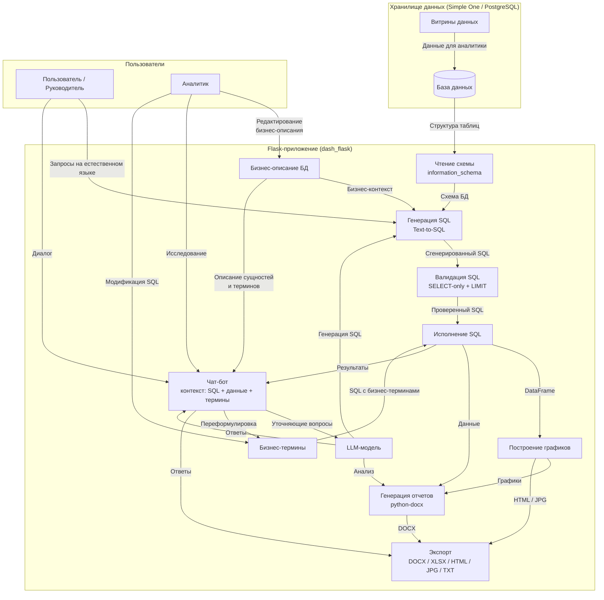
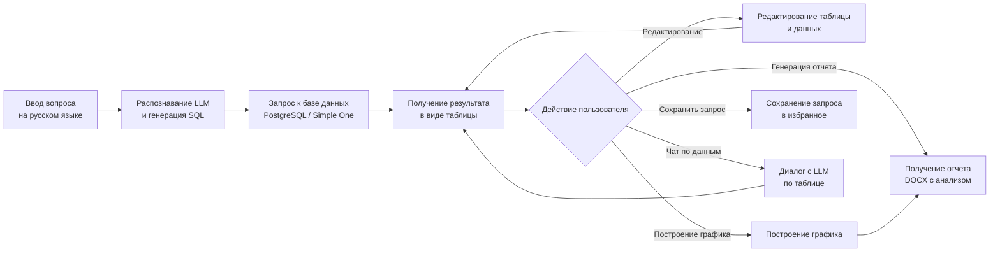
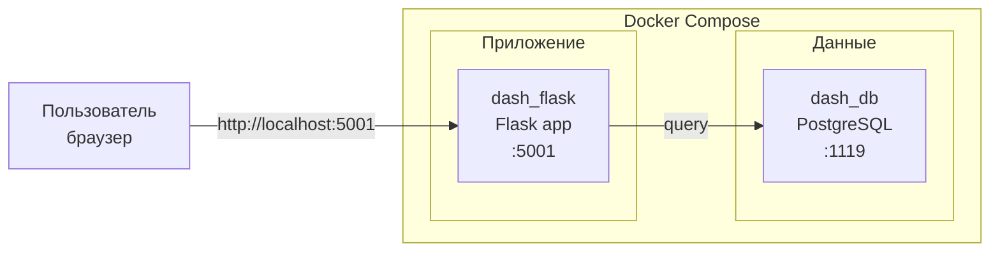
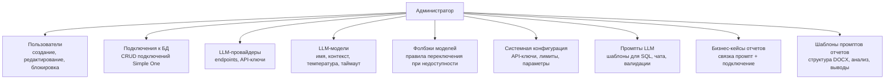
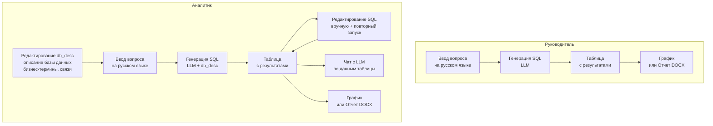

# Архитектура системы Text2BI

## 1. Полный цикл данных (mermaid)



## 2. Описание компонентов и потоков

### 2.1. Источник данных
- **Хранилище** (PostgreSQL / Simple One) содержит пользовательские данные и **витрины данных** (`mart_*`).
- Система автоматически читает структуру через `information_schema.columns`.
- Бизнес-описание (связи таблиц, бизнес-термины) хранится в `system_config.db_desc`.

### 2.2. Генерация и выполнение SQL
1. Пользователь задает вопрос на русском языке.
2. LLM получает: схему БД + бизнес-описание + примеры QA + промпт.
3. Генерируется SQL (Text-to-SQL).
4. Проходит валидацию (только SELECT/WITH, без опасных операций, LIMIT).
5. SQL выполняется против PostgreSQL.
6. Результат возвращается как DataFrame.

### 2.3. Чат-бот с контекстом
- Чат привязан к текущему SQL-запросу и данным.
- LLM может: объяснить SQL, проанализировать ошибку, предложить уточнения, переформулировать запрос.
- Поддерживается **модификация SQL через бизнес-термины** — замена технических алиасов на понятные названия с сохранением структуры запроса.
- В табличном режиме чат работает с данными напрямую, без привязки к SQL.

### 2.4. Визуализация и отчеты
- На основе DataFrame автоматически строятся Plotly-графики (столбчатые, гистограммы).
- Отчет формируется как DOCX-документ: заголовок, данные в виде таблицы, графики, анализ от LLM.
- **Каждый отчет использует выбранный шаблон промпта** — это определяет стиль, глубину анализа и структуру документа.
- Экспорт доступен в HTML, JPG, XLSX, TXT.

### 2.5. Ролевой доступ
- **Администратор** управляет: пользователями, подключениями, промптами, провайдерами, моделями, фолбэками, системными ключами, бизнес-кейсами отчетов.
- **Пользователь** работает с данными: запросы, чат, графики, отчеты.

---

## 3. Линейный поток работы пользователя



### Описание этапов

| Этап | Действие | Результат |
|------|----------|-----------|
| 1 | Пользователь вводит вопрос на русском языке в поле «Запрос» | Текстовый запрос, например: «Покажи выручку по месяцам за прошлый год» |
| 2 | LLM распознаётIntent, анализирует схему БД и генерирует SQL | Готовый SQL-запрос (SELECT ...) |
| 3 | Запрос выполняется против PostgreSQL | Таблица с данными (столбцы + строки) |
| 4 | **Редактирование** — пользователь может править SQL вручную и повторно выполнить | Обновлённая таблица |
| 5 | Построение графика — автоматическая визуализация на основе DataFrame | Plotly-график (HTML/JPG) |
| 6 | Генерация отчета — выбор промпта, формирование DOCX с графиками и анализом | Файл отчета Word |
| 7 | Сохранение запроса — добавление в избранное для быстрого доступа | Сохраненный запрос в БД |
| 8 | Чат по данным — задание уточняющих вопросов LLM о результатах | Ответ LLM с анализом |

---

## 4. Docker-топология



### 4.1. Проброс портов
| Сервис | Хост | Контейнер | Назначение |
|--------|------|-----------|------------|
| `dash_flask` | `5001` | `5001` | Web-интерфейс Text2BI |
| `dash_db` | `1119` | `5432` | PostgreSQL (данные + конфиг) |

### 4.2. База настроек и конфигурации
База `dash_config` (схема `app`) хранит всю конфигурацию системы:
- Пользователи и права (`users`)
- Подключения к БД (`connection_settings`)
- Системные ключи (`system_config`): API-ключи, лимиты, описание БД
- Шаблоны промптов (`prompts`, `prompt_reports`)
- Провайдеры и модели LLM (`llm_providers`, `llm_models`, `llm_fallback`)
- Бизнес-кейсы отчетов (`report_prompt_cases`)
- Сохраненные запросы (`saved_queries`)

### 4.3. Сети и volumes
- Все контейнеры находятся в одной Docker-сети и обращаются друг к другу по имени сервиса (`dash_db`).
- Volumes: `dash_postgres` (данные PostgreSQL).

---

## 5. Модель данных (кратко)

```
app/
├── users                        — пользователи (логин, пароль, тема)
├── connection_settings          — подключения к БД
├── system_config                — ключ-значение настройки
├── prompts                      — шаблоны промптов LLM
├── saved_queries                — сохраненные запросы пользователей
├── prompt_reports               — шаблоны промптов для отчетов
├── llm_providers                — LLM-провайдеры
├── llm_models                   — LLM-модели
├── llm_fallback                 — правила фолбэка моделей
└── report_prompt_cases          — бизнес-кейсы отчетов
```

---

## 6. Администратор — зона управления и конфигурации



### Описание зоны администратора

| Область | Что настраивает |
|---------|-----------------|
| **Пользователи** | Создание, редактирование, блокировка аккаунтов |
| **Подключения** | Параметры подключения к Simple One (host, port, db, user, password) |
| **Провайдеры** | LLM-провайдеры: endpoint URL, API-ключи |
| **Модели** | LLM-модели: имя, контекст, температура, таймаут, флаг по умолчанию |
| **Фолбэки** | Правила переключения на резервную модель при недоступности |
| **Системная конфигурация** | API-ключи Redash, лимиты строк, дефолтные значения |
| **Промпты** | Шаблоны для генерации SQL, валидации, объяснения, бизнес-терминов, чата |
| **Бизнес-кейсы отчетов** | Связки «название отчета → промпт → подключение» |
| **Шаблоны отчетов** | Промпты, определяющие структуру DOCX: что анализировать, какие выводы делать |

---

## 7. Руководитель и Аналитик — зона работы с данными



### Описание зоны пользователей

| Роль | Действие | Результат |
|------|----------|-----------|
| **Руководитель** | Вводит вопрос на русском | SQL-запрос, сгенерированный LLM |
| **Руководитель** | Просматривает таблицу | Данные в виде таблицы |
| **Руководитель** | Строит график / отчет | Визуализация или DOCX-документ |
| **Аналитик** | Редактирует `db_desc` | Обновлённое описание БД с бизнес-терминами |
| **Аналитик** | Вводит вопрос на русском | SQL с учётом `db_desc` |
| **Аналитик** | Правки SQL вручную | Обновлённая таблица |
| **Аналитик** | Чат по таблице | Ответы LLM с уточняющим анализом |
```
